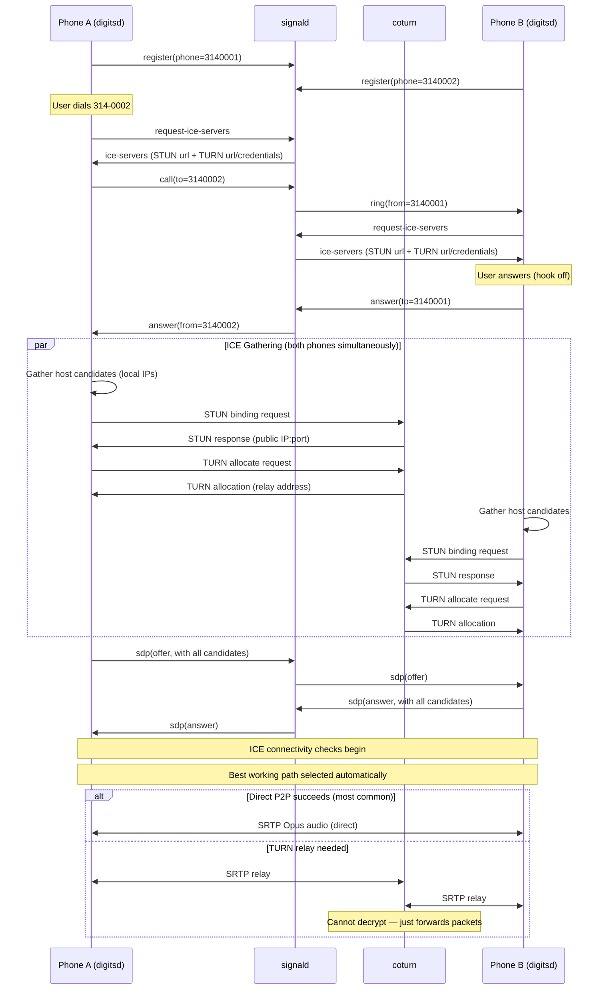

# Digits Network Architecture: NAT Traversal & Peer Connectivity

## Status: **Design Document — Approved for Implementation**

**Date:** 2026-03-22
**Relates to:** [VoIP Call Path Architecture](voip-call-path.md)

---

## Executive Summary

Digits phones will live on separate home LANs behind consumer NAT routers. Users must **never** need to configure routers, open ports, or set up DMZ. This document defines the networking architecture that makes cross-network encrypted voice calls "just work."

**Decision:** Use **standard WebRTC ICE** with both STUN and TURN servers. Self-host a **coturn** TURN server alongside the existing Go signaling server. This gives us ~100% connection success rate with zero user network configuration, while keeping the architecture simple and the E2E encryption guarantee intact.

---

## 1) NAT Traversal Primer: STUN vs TURN vs ICE

### The Problem

Two Digits phones on different home networks each have private IPs (e.g., `192.168.1.x`). Neither can directly reach the other. Consumer routers perform NAT (Network Address Translation), mapping internal IPs to the router's public IP with ephemeral port assignments.

### The Protocols

| Protocol | What It Does | Latency | Bandwidth Cost | Coverage |
|----------|-------------|---------|----------------|----------|
| **STUN** | Discovers your public IP:port mapping. Enables direct P2P through compatible NATs | Zero relay overhead | None (discovery only) | ~80% of residential connections |
| **TURN** | Relays all media through a server when direct connection fails | +10-50ms RTT | Server bears full media bandwidth | ~100% (guaranteed fallback) |
| **ICE** | Framework that tries candidates in priority order: direct → STUN → TURN | Best available | Minimal (uses TURN only when needed) | ~100% with TURN fallback |

### How ICE Works (the algorithm we use)

```
1. Gather candidates:
   a. Host candidates (local LAN IPs — works for same-network calls)
   b. Server-reflexive candidates (public IP via STUN — works for most NATs)
   c. Relay candidates (TURN server allocation — guaranteed fallback)

2. Exchange candidates via signaling server (our existing Go signald)

3. Connectivity checks: try all candidate pairs, pick the best working one

4. Media flows on the winning path
```

**Key insight:** ICE is not a choice *between* STUN and TURN. It uses both. STUN is attempted first (free, direct, low latency). TURN is the safety net. This is exactly what WebRTC's ICE implementation does automatically.

---

## 2) Why TURN Is Non-Negotiable

### Symmetric NAT and CGNAT: The STUN-Breakers

**Symmetric NAT** assigns a different external port for each destination. STUN discovers one mapping, but the peer gets a *different* port — so the discovered address is useless. STUN-only connections fail.

**Carrier-Grade NAT (CGNAT)** puts an extra NAT layer between the subscriber and the internet (common with IPv4 exhaustion). Frequently behaves as symmetric NAT. ISPs using CGNAT include many mobile carriers and increasingly some residential providers (T-Mobile Home Internet, Starlink, some fiber ISPs).

### Failure Rates Without TURN

| Scenario | STUN-only success | Notes |
|----------|-------------------|-------|
| Both peers: standard residential NAT (full-cone/restricted) | ~92-95% | Most common case |
| One peer: symmetric NAT or CGNAT | ~0% | STUN fails, no fallback |
| Both peers: symmetric NAT | ~0% | Completely broken |
| **Real-world blended average** | **~80%** | **~20% of sessions need TURN** |

Industry data consistently shows **~20% of WebRTC connections require TURN relay** to succeed. For a phone product targeting families, a 1-in-5 failure rate is unacceptable — especially when the failure mode is "the call just doesn't connect" with no workaround.

### The CGNAT Trend Is Getting Worse

- IPv4 exhaustion is driving more CGNAT adoption
- T-Mobile 5G Home Internet, Starlink, and many MVNO/fixed-wireless providers use CGNAT by default
- Some fiber ISPs (especially in apartments/MDUs) use CGNAT
- **Digits users on these connections would have zero connectivity without TURN**

### Conclusion

**TURN is mandatory infrastructure for Digits.** Not optional, not "nice to have." Without it, we guarantee call failures for a significant and growing percentage of users.

---

## 3) TURN Server: Self-Hosted coturn

### Why Self-Host

| Option | Pros | Cons |
|--------|------|------|
| **Public STUN only** (Google's stun:stun.l.google.com:19302) | Free, no infra | No TURN = 20% failure rate |
| **Managed TURN** (Twilio, Xirsys, Cloudflare) | Zero ops | Per-minute/per-GB costs add up; vendor lock-in; privacy concerns |
| **Self-hosted coturn** ✅ | Full control, predictable cost, privacy, open source | Must maintain a server |

For a privacy-focused, E2E encrypted phone system, self-hosting the relay infrastructure is the right call. We don't want a third party in the media relay path, even though E2E encryption means they can't read the content.

### coturn Overview

[coturn](https://github.com/coturn/coturn) is the standard open-source TURN/STUN server. Used by Jitsi, Nextcloud Talk, Matrix/Element, and most self-hosted WebRTC deployments.

- **Handles both STUN and TURN** in a single process
- Supports UDP, TCP, and TLS transports
- Supports TURN over TCP/443 (critical for restrictive firewalls)
- Time-limited credentials via shared secret (integrates with our signaling server)
- Battle-tested at scale: thousands of concurrent relayed calls per CPU core
- Single static binary, easy to containerize

### Deployment Architecture

```
┌─────────────────────────────────────────────────┐
│              VPS (Public IP)                     │
│                                                  │
│  ┌──────────────┐    ┌────────────────────────┐  │
│  │   signald    │    │       coturn            │  │
│  │  (Go, :443)  │    │  STUN: UDP/3478        │  │
│  │  WebSocket   │◄──►│  TURN: UDP/3478        │  │
│  │  signaling   │    │  TURN/TLS: TCP/443     │  │
│  │              │    │  (shared-secret auth)   │  │
│  └──────────────┘    └────────────────────────┘  │
│                                                  │
└─────────────────────────────────────────────────┘
        ▲                       ▲
        │ WSS                   │ STUN/TURN
        │                       │
   ┌────┴────┐            ┌─────┴─────┐
   │ Phone A │◄──SRTP────►│ Phone B   │
   │ (home)  │  (direct)  │ (home)    │
   └─────────┘            └───────────┘

   If direct fails:

   ┌─────────┐    TURN    ┌─────────┐
   │ Phone A │◄──relay───►│ coturn  │◄──relay───►│ Phone B │
   └─────────┘            └─────────┘            └─────────┘
```

### Credential Flow

1. Phone connects to signald via WebSocket
2. Before initiating a call, phone requests TURN credentials from signald
3. signald generates time-limited credentials using a shared secret with coturn (HMAC-based, per RFC 5766 long-term credential mechanism)
4. Phone uses credentials in its ICE configuration
5. Credentials expire after the call window (e.g., 24 hours)

This means **no static passwords** are embedded on devices, and credentials rotate automatically.

### Hosting & Cost

**VoIP bandwidth is tiny.** Opus at typical VoIP settings:

| Parameter | Value |
|-----------|-------|
| Opus bitrate | 24-32 kbps (excellent quality for voice) |
| IP/UDP/RTP overhead | ~10-15 kbps |
| **Per-call bandwidth** | **~35-50 kbps per direction** |
| **Per-call total (bidirectional)** | **~70-100 kbps** |
| 10 simultaneous relayed calls | ~1 Mbps |
| Monthly @ 10 concurrent relayed calls, 24/7 | ~330 GB |

**Realistic early usage:** 5-20 Digits phones, maybe 2-3 concurrent calls at peak, ~20% relayed through TURN = typically 0-1 relayed calls at any time.

**Server requirements:**

| Resource | Minimum | Recommended |
|----------|---------|-------------|
| CPU | 1 vCPU | 1 vCPU (coturn is efficient) |
| RAM | 512 MB | 1 GB (with signald) |
| Bandwidth | 1 TB/mo | 1 TB/mo (massive overkill for early use) |
| Public IP | 1 static IPv4 | 1 static IPv4 |
| **Estimated cost** | **$5-10/mo** | **$5-10/mo** (Hetzner, OVH, Contabo) |

A $5/month VPS can comfortably run both signald and coturn for the pilot phase and well beyond. VoIP bandwidth is negligible compared to video.

---

## 4) Signaling Server Integration

The existing Go signaling server (`signald`, on `feature/signaling-server`) already handles:
- WebSocket connections from phones
- Registration, call initiation, ring, answer, hangup
- SDP offer/answer relay
- ICE candidate relay

### What Needs to Be Added

1. **TURN credential endpoint:** New WebSocket message type (e.g., `turn-credentials`) or REST endpoint that returns time-limited TURN credentials generated from the shared secret.

2. **ICE server configuration:** When a phone registers or requests call setup, signald provides the ICE server list:
   ```json
   {
     "type": "ice-servers",
     "servers": [
       {
         "urls": ["stun:turn.digits.example.com:3478"]
       },
       {
         "urls": [
           "turn:turn.digits.example.com:3478?transport=udp",
           "turn:turn.digits.example.com:3478?transport=tcp",
           "turns:turn.digits.example.com:443?transport=tcp"
         ],
         "username": "<time-limited-username>",
         "credential": "<hmac-credential>"
       }
     ]
   }
   ```

3. **No media touches the signaling server.** signald remains a pure signaling/control plane. Media flows either directly P2P or through coturn — never through signald.

### Architecture Principle: Signaling ≠ Media

```
signald:   call setup, teardown, presence, directory, credentials
coturn:    STUN responses, TURN relay (only when needed)
phones:    SRTP media (always encrypted end-to-end)
```

This separation is critical. The signaling server sees *who* is calling *whom* and *when*, but never touches the encrypted media. coturn relays encrypted SRTP packets it cannot decrypt. **E2E encryption is preserved regardless of the media path.**

---

## 5) Symmetric NAT / CGNAT Deep Dive

### NAT Types and Their Behavior

| NAT Type | STUN Works? | P2P Possible? | Prevalence |
|----------|-------------|---------------|------------|
| **Full Cone** | ✅ | ✅ Easy | Rare (mostly enterprise/older routers) |
| **Address-Restricted Cone** | ✅ | ✅ With hole-punching | Common residential |
| **Port-Restricted Cone** | ✅ | ✅ With hole-punching | Most common residential |
| **Symmetric** | ⚠️ Discovers address but port is wrong | ❌ STUN fails | ~8-15% of residential |
| **CGNAT (any type)** | Depends on outer NAT | Often ❌ | Growing: ~15-25% of US residential |

### Worst Cases for Digits Users

1. **Both on CGNAT** (e.g., both families on T-Mobile Home Internet): Double NAT, very likely symmetric behavior. STUN will fail. **TURN required.**

2. **One on CGNAT, one on normal residential NAT**: Asymmetric. The CGNAT side may have symmetric behavior. **TURN likely required.**

3. **Corporate/apartment building shared internet**: Often restrictive firewall + NAT. **TURN over TCP/443 may be needed** (looks like HTTPS, passes most firewalls).

4. **Mobile hotspot tethering** (temporary/travel): Almost always CGNAT. **TURN required.**

### Why We Must Support TURN-over-TLS on Port 443

Some networks block all UDP and all non-standard TCP ports. The last-resort path is TURN over TLS on TCP port 443, which looks identical to HTTPS traffic. This works through virtually every firewall and proxy.

coturn supports this natively. We configure it to listen on TCP/443 (or share via SNI routing if signald also needs 443).

---

## 6) Alternative Considered: Tailscale / WireGuard Mesh

### The Idea

Instead of WebRTC ICE + TURN, put all Digits phones on a Tailscale mesh network (or self-hosted Headscale + WireGuard). Every phone gets a stable IP on the mesh. NAT traversal is handled by Tailscale's DERP relay servers. Direct peer-to-peer WireGuard tunnels form when possible.

### Comparison

| Factor | WebRTC ICE + coturn | Tailscale/WireGuard Mesh |
|--------|--------------------|--------------------------| 
| **NAT traversal** | ICE (STUN + TURN) | Tailscale DERP + WireGuard hole-punching |
| **Fallback relay** | coturn (self-hosted) | DERP (Tailscale-hosted or self-hosted) |
| **Encryption** | SRTP (DTLS-SRTP key exchange) | WireGuard (Noise protocol) |
| **E2E guarantee** | ✅ SRTP keys negotiated between endpoints | ✅ WireGuard tunnel between endpoints |
| **Extra dependency** | None (Pion handles everything) | Tailscale daemon on every Pi |
| **Auth/identity** | Our signaling server controls enrollment | Tailscale coordination server (or Headscale) |
| **Pi Zero 2 W support** | Native (Go/Pion compiles for armv6/arm64) | Tailscale supports ARM Linux, but adds ~50MB+ RAM overhead |
| **Complexity** | Standard WebRTC stack | Additional networking layer + auth system |
| **Operational control** | Full (we run everything) | Partial (depends on Tailscale infra, or run Headscale) |
| **Audio codec integration** | Native (Opus in WebRTC) | Must layer audio protocol on top of tunnel |
| **Call signaling** | Built into our existing system | Still need signaling for ring/answer/hangup |
| **Resource overhead on Pi** | Pion + our daemon only | WireGuard kernel module + tailscaled + our daemon |

### Verdict: WebRTC ICE Wins

Tailscale is excellent infrastructure, but it's **solving a different problem** (persistent mesh networking) while we need **ephemeral media sessions** (phone calls). Adding Tailscale would mean:

1. Running an extra daemon on a resource-constrained Pi Zero 2 W (512 MB RAM)
2. Managing a separate identity/auth system (Tailscale ACLs or Headscale)
3. Still needing our signaling server for call semantics
4. Still needing to implement audio codec, jitter buffering, etc. (WireGuard is just a tunnel, not a media framework)
5. Trading one relay dependency (coturn, self-hosted) for another (DERP, less control)

WebRTC ICE gives us NAT traversal, encryption, codec, jitter handling, and relay fallback **in one integrated stack.** The existing signaling server already speaks the right protocol. Adding a Tailscale layer would be architectural complexity for no clear benefit.

**Recommendation: Do not use Tailscale/WireGuard for call media transport.** (It could be useful separately for device management/SSH access, but that's a different concern.)

---

## 7) Bandwidth Requirements & TURN Sizing

### Opus VoIP Bandwidth

| Profile | Opus Bitrate | With RTP/UDP/IP | Notes |
|---------|-------------|-----------------|-------|
| Narrowband (8 kHz) | 12-16 kbps | ~25-30 kbps | Classic phone quality |
| Wideband (16 kHz) | 20-32 kbps | ~35-50 kbps | Clear, natural voice |
| **Recommended default** | **24 kbps Opus** | **~40 kbps total** | Good balance of quality vs bandwidth |

### TURN Server Sizing

TURN relay means the server handles **both directions** of media for each relayed call:

| Metric | Value |
|--------|-------|
| Per relayed call | ~80 kbps (40 kbps × 2 directions) |
| 10 concurrent relayed calls | ~800 kbps |
| 100 concurrent relayed calls | ~8 Mbps |
| Monthly data @ 10 relayed calls, avg 2 hrs/day | ~7 GB/month |
| Monthly data @ 100 relayed calls, avg 2 hrs/day | ~70 GB/month |

**For pilot phase (5-20 phones):** A $5/month VPS with 1 TB bandwidth is absurdly overprovisioned. Even at scale, VoIP TURN relay is very cheap compared to video.

### CPU Sizing

coturn is highly efficient for audio-only relay:
- **1 vCPU** can handle thousands of simultaneous VoIP TURN relays
- CPU is not the bottleneck; bandwidth and connection count are
- Pi Zero 2 W's network capacity (~1.5 Mbps measured WiFi throughput per existing testing) is the actual bottleneck, and it's more than sufficient for a single voice call

---

## 8) Recommended Architecture

### Decision Summary

| Component | Choice | Rationale |
|-----------|--------|-----------|
| **NAT traversal** | ICE (STUN + TURN) | Industry standard, ~100% success rate |
| **STUN** | coturn (same instance as TURN) | Free, lightweight, enables P2P for ~80% of calls |
| **TURN** | Self-hosted coturn | Mandatory for ~20% of calls; self-hosted for privacy/control |
| **TURN transport** | UDP/3478 + TCP/3478 + TLS/443 | Maximum compatibility across network types |
| **Signaling** | Existing Go signald + TURN credential endpoint | Minimal change to existing architecture |
| **Media transport** | WebRTC (Pion on Pi, SRTP/Opus) | Already aligned with current signaling protocol |
| **VPN/mesh overlay** | Not used for media | Unnecessary complexity; WebRTC handles everything |
| **E2E encryption** | DTLS-SRTP (WebRTC native) | Keys negotiated between endpoints; relay cannot decrypt |

### Full System Diagram

```
┌──────────────────────────────────────────────────────────────────────┐
│                        Cloud VPS ($5-10/mo)                          │
│                                                                      │
│  ┌─────────────────────────┐     ┌─────────────────────────────────┐ │
│  │        signald           │     │           coturn                │ │
│  │                          │     │                                 │ │
│  │  • WS signaling (:443)   │     │  • STUN:      UDP :3478        │ │
│  │  • Call control           │◄───►│  • TURN:      UDP :3478        │ │
│  │  • Phone directory        │     │  • TURN/TCP:  TCP :3478        │ │
│  │  • TURN credential gen    │     │  • TURN/TLS:  TCP :5349 or     │ │
│  │  • Admin dashboard        │     │              TCP :443 (SNI)    │ │
│  │  • Policy enforcement     │     │  • Shared-secret auth          │ │
│  └─────────────────────────┘     └─────────────────────────────────┘ │
│            ▲                                    ▲                     │
└────────────┼────────────────────────────────────┼────────────────────┘
             │ WSS (signaling)                    │ STUN/TURN (media relay)
             │                                    │
    ┌────────┼────────────────────────────────────┼─────────┐
    │        │            Internet                │         │
    │        │                                    │         │
    │   ┌────┴─────┐                         ┌────┴─────┐  │
    │   │ Router A │  (NAT)                  │ Router B │  │
    │   └────┬─────┘                         └────┬─────┘  │
    │        │                                    │         │
    └────────┼────────────────────────────────────┼─────────┘
             │                                    │
     ┌───────┴───────┐                   ┌───────┴───────┐
     │  Digits Phone A│                   │  Digits Phone B│
     │                │                   │                │
     │  Pi Zero 2 W   │◄────────────────►│  Pi Zero 2 W   │
     │  + Pico + Codec │   Direct SRTP    │  + Pico + Codec │
     │                │   (when ICE      │                │
     │                │    finds P2P)    │                │
     └────────────────┘                   └────────────────┘
```

### ICE Candidate Priority (what happens during call setup)

```
Priority 1: Host candidates (same LAN — both phones in one house)
    → Direct connection, zero relay, lowest latency
    → ~5% of calls (sibling phones in same household)

Priority 2: Server-reflexive candidates (STUN-discovered public IP:port)
    → Direct P2P through NAT hole-punching
    → ~75% of calls (standard residential NAT on both sides)

Priority 3: Relay candidates (TURN)
    → Media relayed through coturn server
    → ~20% of calls (symmetric NAT, CGNAT, restrictive firewalls)
    → +10-50ms latency, but still well within VoIP quality targets

Result: 100% connection success rate, zero user configuration
```

### Call Setup Sequence (with NAT traversal)



---

## 9) Implementation Plan

### Phase 1: Infrastructure (alongside current signaling server work)

- [ ] Deploy coturn on VPS alongside signald
- [ ] Configure coturn with shared secret
- [ ] Add TURN credential generation to signald
- [ ] Add `ice-servers` message type to signaling protocol
- [ ] Test STUN/TURN connectivity from Pi Zero 2 W on home network

### Phase 2: Client Integration (in Pi `digitsd` daemon)

- [ ] Configure Pion WebRTC with ICE servers from signald
- [ ] Implement ICE candidate gathering and exchange via existing signaling
- [ ] Verify P2P connection on LAN (host candidates)
- [ ] Verify P2P connection across networks (server-reflexive candidates)
- [ ] Verify TURN relay when simulating symmetric NAT

### Phase 3: Hardening

- [ ] TURN credential rotation and expiry
- [ ] Connection quality monitoring (ICE candidate type used, RTT, packet loss)
- [ ] Fallback: if ICE fails entirely, provide clear error to user (busy tone + server log)
- [ ] Rate limiting on TURN allocations (prevent abuse)

### coturn Configuration (reference)

```ini
# /etc/turnserver.conf

# Network
listening-port=3478
tls-listening-port=5349
alt-tls-listening-port=443

# Use fingerprint for TURN messages
fingerprint

# Long-term credential mechanism
lt-cred-mech

# Shared secret with signald for time-limited credentials
use-auth-secret
static-auth-secret=<GENERATED_SECRET>

# Realm
realm=digits.example.com

# TLS certificates (Let's Encrypt)
cert=/etc/letsencrypt/live/turn.digits.example.com/fullchain.pem
pkey=/etc/letsencrypt/live/turn.digits.example.com/privkey.pem

# Logging
log-file=/var/log/turnserver.log

# Security
no-multicast-peers
denied-peer-ip=10.0.0.0-10.255.255.255
denied-peer-ip=172.16.0.0-172.31.255.255
denied-peer-ip=192.168.0.0-192.168.255.255

# Performance (VoIP is lightweight)
total-quota=100
stale-nonce=600
```

---

## 10) Security Considerations

### E2E Encryption Preservation

| Media Path | Encrypted? | Who Can Decrypt? |
|------------|-----------|-----------------|
| Direct P2P (SRTP) | ✅ DTLS-SRTP | Only the two phones |
| Via TURN relay (SRTP) | ✅ DTLS-SRTP | Only the two phones |
| Signaling (WSS) | ✅ TLS | signald sees metadata (who calls whom), not media |

**TURN relay sees only encrypted SRTP packets.** Even if the TURN server is compromised, call audio cannot be decrypted. The DTLS-SRTP keys are negotiated directly between the phone endpoints during the WebRTC handshake.

### Threat Model for Network Layer

| Threat | Mitigation |
|--------|-----------|
| TURN credential theft | Time-limited (24h expiry), HMAC-based, per-session |
| TURN server compromise | Cannot decrypt SRTP; can only observe encrypted traffic patterns |
| Signaling server compromise | Sees call metadata but not audio; future: add signaling encryption |
| Man-in-the-middle on DTLS | WebRTC DTLS fingerprint verification (can add out-of-band verification later) |
| DoS on TURN server | Rate limiting, quotas, fail-closed (phones get busy signal) |

---

## 11) Hosting: Self-Hosted on Home Network

### Infrastructure (Decided)

- **Domain:** `digits.family`
- **Host:** Any server with ample CPU/RAM for signald + coturn
- **Network:** Broadband connection. VoIP relay traffic is lightweight.
- **Ingress stack:** Reverse proxy (e.g., Caddy, nginx) with TLS termination. Let's Encrypt certs recommended.
- **Existing services on GPU box:** Gitea, Ollama, ComfyUI, Paperless, SearXNG, n8n, Hugo sites, Authelia, Meshtastic web, Bramble web client, etc. All Dockerized under `~/src/dockers/`.

### Ingress Plan for Digits

- **signald (WebSocket):** Standard HTTPS reverse proxy through Caddy. Add `signald.digits.family` (or similar) site block pointing to the signald container.
- **coturn (STUN/TURN):** **Requires direct UDP port forwards on the router** — cannot be proxied through nginx/Caddy. Forward UDP 3478 (STUN/TURN) and a relay port range (e.g., UDP 49152-49252) to the GPU box.
- **coturn TURN-over-TLS (TCP/443):** For restrictive-firewall fallback. Needs SNI routing to share port 443 with Caddy, or a dedicated subdomain/IP. Options:
  - Caddy `layer4` module for SNI-based TCP routing (`turn.digits.family` → coturn, everything else → normal Caddy)
  - Separate public IP (if router supports)
  - coturn on TCP/5349 instead of 443 (simpler, covers most cases; true 443-only networks are rare)
- **TLS certs:** Let's Encrypt via Caddy or certbot for `*.digits.family` (or specific subdomains).
- **DNS:** CNAME `signald.digits.family` and `turn.digits.family` → dynamic DNS or static IP.

### Scale Path

Home network handles 5-20 phones easily. If Digits gains traction (Kickstarter), migrate signald + coturn to cloud VPS ($5-10/mo) or AWS. Architecture is the same — just point DNS elsewhere.

---

## 12) Open Questions

1. **IPv6:** coturn supports dual-stack. As IPv6 adoption grows, more connections will be direct (no NAT). But we still need TURN for IPv4-only networks, which will persist for years.

2. **Monitoring:** Track ICE candidate types used per call (host vs srflx vs relay) to understand real-world NAT distribution across Digits deployments.

3. **Dynamic DNS:** Home IP may change (check ISP). If so, use a DDNS provider or a simple cron that updates the DNS record.

---

## Appendix A: Glossary

| Term | Definition |
|------|-----------|
| **STUN** | Session Traversal Utilities for NAT — discovers public IP:port mapping |
| **TURN** | Traversal Using Relays around NAT — relays media when direct connection fails |
| **ICE** | Interactive Connectivity Establishment — tries all paths, picks the best |
| **SRTP** | Secure Real-time Transport Protocol — encrypted media transport |
| **DTLS** | Datagram Transport Layer Security — key exchange for SRTP |
| **CGNAT** | Carrier-Grade NAT — ISP-level NAT, often symmetric |
| **SDP** | Session Description Protocol — describes media capabilities and candidates |
| **Pion** | Go WebRTC library (used in Pi digitsd daemon) |
| **coturn** | Open-source TURN/STUN server |

## Appendix B: References

- [RFC 8445 — ICE: A Protocol for NAT Traversal](https://datatracker.ietf.org/doc/html/rfc8445)
- [RFC 5766 — TURN: Relay Extensions to STUN](https://datatracker.ietf.org/doc/html/rfc5766)
- [RFC 5389 — STUN](https://datatracker.ietf.org/doc/html/rfc5389)
- [coturn project](https://github.com/coturn/coturn)
- [Pion WebRTC](https://github.com/pion/webrtc)
- [Tailscale: How NAT Traversal Works](https://tailscale.com/blog/how-nat-traversal-works) — excellent primer
- [WebRTC.ventures: ICE in WebRTC](https://webrtc.ventures/2022/04/ice-in-webrtc/) — real-world performance data
