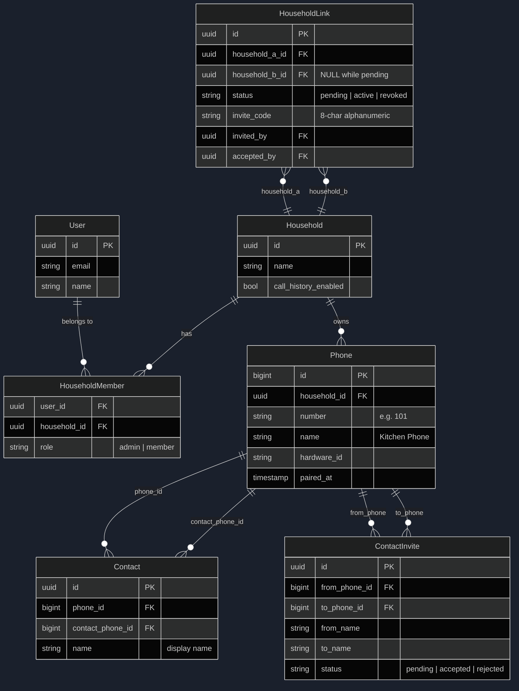
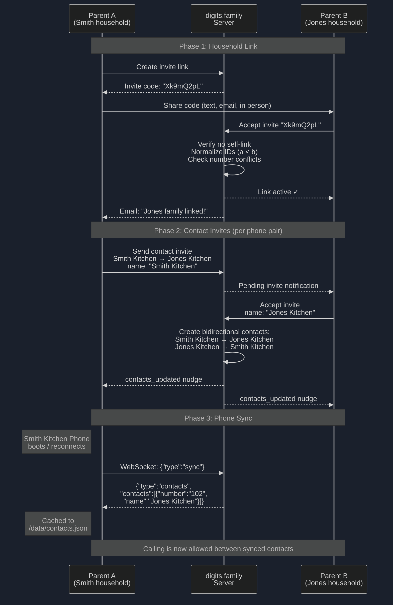

# Architecture Overview

## Introduction

Digits is a point-to-point encrypted phone network built from gutted vintage desk phones. Each phone is a self-contained VoIP endpoint -- the server only relays call setup messages and never touches audio. All media is encrypted end-to-end with DTLS-SRTP between the two phones directly.

## System Components

```
┌─────────────────────────────────┐         ┌─────────────────────────────────┐
│         Digits Phone A          │         │         Digits Phone B          │
│                                 │         │                                 │
│  ┌───────┐    ┌──────────────┐  │         │  ┌──────────────┐    ┌───────┐  │
│  │ Pico  │◄──►│   Pi Zero    │  │         │  │   Pi Zero    │◄──►│ Pico  │  │
│  │ RP2040│UART│   (digitsd)  │  │         │  │   (digitsd)  │UART│ RP2040│  │
│  └───────┘    └──────┬───────┘  │         │  └──────┬───────┘    └───────┘  │
│         Codec Zero   │          │         │         │   Codec Zero          │
└──────────────────────┼──────────┘         └─────────┼───────────────────────┘
                       │  WebSocket signaling          │
                       └────────────┬─────────────────┘
                                    │
                             ┌──────▼──────┐
                             │   signald   │
                             │  (Go server)│
                             └─────────────┘
```

### RP2040 Pico

Real-time hardware controller. Manages the hook switch, keypad scanning, bell driver, tone generation (dial tone, ringback, busy), and status LED. Communicates with the Pi Zero over UART using a line-based ASCII protocol -- see [uart-protocol.md](uart-protocol.md) for the full spec.

### Pi Zero 2 W (digitsd)

Runs `digitsd`, a Go daemon that handles all call logic and network communication:

- WebSocket client for signaling against `signald`
- WebRTC media endpoint via [Pion](https://github.com/pion/webrtc) -- SDP negotiation, ICE, DTLS-SRTP
- Opus encode/decode for audio
- ALSA audio I/O via the Codec Zero
- OTA updates for both the daemon and Pico firmware
- Wi-Fi provisioning and device pairing

### Codec Zero (DA7212)

A Raspberry Pi audio pHAT using the Dialog DA7212 codec. Accepts an external electret microphone via a 3.5mm TRS jack and drives a mono speaker via screw terminal. Controlled over I2C, audio data over I2S.

### signald

Go server running in the cloud. Responsibilities:

- WebSocket relay for SDP offers/answers and ICE candidates
- User authentication (magic links + Google OAuth)
- Household and line management
- Admin panel

signald does not touch audio at any point.

## Data Model



- **Household** -- a family group. Owns one or more lines.
- **Line** -- a 7-digit phone number. Belongs to a household. A physical device pairs to a line.
- **Device** -- a physical Digits phone. Paired to a line via a one-time pairing code.
- **HouseholdLink** -- a connection between two households established via invite code. Once linked, any line in household A can call any line in household B.



Households connect by exchanging invite codes through the web app. Once linked, all lines in both households can reach each other. Links are symmetric -- either side can revoke them.

## Call Path

Digits uses WebRTC for media transport. DTLS-SRTP provides end-to-end encryption. The signaling server relays setup messages but never sees audio.

**Why WebRTC:** It reuses an existing, well-understood signaling protocol. Pion (Go WebRTC library) runs natively on the Pi Zero with no CGO. Opus delivers high quality audio at low bitrate. SRTP is built in. The alternative -- raw RTP or a custom SIP stack -- would have required building encryption, codec negotiation, and NAT traversal from scratch.

### Outgoing Call Flow

1. User lifts handset -- Pico sends `HOOK:OFF`, digitsd plays dial tone
2. User dials 7 digits -- Pico sends `KEY` events, then `DIAL:<number>`
3. digitsd creates a WebRTC peer connection with a local Opus audio track
4. SDP offer sent to signald, relayed to the called phone
5. Called phone answers -- SDP answer returned, ICE candidates exchanged
6. SRTP media flows directly between the two Pis
7. Either party hangs up -- digitsd sends hangup message, tears down peer connection

### Incoming Call Flow

1. signald sends a ring message to digitsd
2. digitsd sends `RING:START` to Pico -- mechanical bell rings
3. User lifts handset -- Pico sends `HOOK:OFF`
4. digitsd creates a peer connection and generates an SDP answer
5. ICE candidates exchanged, SRTP media established

### Audio Pipeline

- **Capture:** ALSA `plughw:1,0` at 48kHz stereo -- right channel extracted (external mic on TRS jack)
- **Processing:** Optional RNNoise ML denoiser for background noise suppression
- **Encode:** Opus 48kHz mono, 24kbps, VoIP mode, in-band FEC, 20ms frames
- **Transport:** RTP/SRTP via Pion WebRTC
- **Decode:** Opus decoder on the receiving Pi
- **Playback:** Mixed with local tones via audio mixer, output to ALSA

Typical one-way end-to-end latency: 75-90ms.

## NAT Traversal

Phones on different home networks require NAT traversal. Digits uses WebRTC ICE with three candidate types, tried in order:

1. **Host candidates** -- direct LAN connection when both phones are on the same network
2. **STUN** -- discovers public IP and port through a STUN server. Succeeds for roughly 75% of connections
3. **TURN relay** -- fallback for symmetric NAT and CGNAT. The signald server provides time-limited TURN credentials (HMAC-based, RFC 5766) for a self-hosted coturn instance

**Why TURN is mandatory:** Approximately 20% of connections fail without relay. Symmetric NAT and CGNAT -- common on T-Mobile Home Internet, Starlink, and many ISPs -- make STUN-only insufficient. Using self-hosted coturn preserves privacy: the relay only sees encrypted SRTP that it cannot decrypt.

Bandwidth per active TURN-relayed call: ~40kbps per direction. Negligible at small scale.

## Current Status

### Working

- Bidirectional Opus/WebRTC audio on LAN
- End-to-end encrypted calls (DTLS-SRTP)
- Mechanical bell, dial tone, ringback, and busy tone
- Household linking via invite codes
- Device pairing via one-time codes
- OTA firmware and daemon updates
- Service codes (volume control, audio test, shutdown, reboot, re-pair, Wi-Fi setup, factory reset)
- RNNoise background noise suppression

### Next

- TURN/STUN integration in digitsd -- server-side credential generation is built; client needs to request and use ICE servers from signald before creating peer connections (currently LAN-only)
- Reconnect/ICE restart on dropped WebRTC connections
