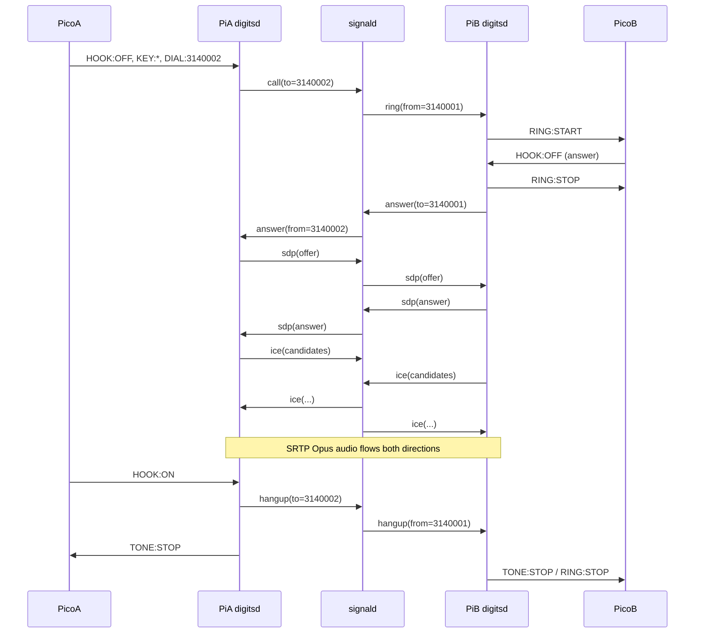

# Digits VoIP Call Path Architecture

## Scope

This document audits the current Digits implementation (`server/`, `pi/`, `firmware/`, `docs/`) and defines the target architecture for real voice calls between two Digits phones using Pi Zero 2 W + Codec Zero audio hardware.

---

## 1) Current State Audit

## 1.1 Go signaling server (`server/`)

### What exists today
- WebSocket signaling server (`/ws`) with JSON message relay for:
  - `register`, `call`, `ring`, `sdp`, `ice`, `answer`, `hangup`, `error`
- Online connection hub keyed by phone number.
- Call tracker with SQLite persistence (`calls` table), active-call memory map, and web dashboard UI.
- Directory CRUD (`phones` table) and web UI (`/phones`, `/calls`, `/settings`).
- End-to-end tests already exercise full signaling sequence including SDP/ICE relay.

### What is missing for production phone calls
- **No media pipeline** in server (no RTP/SRTP receiver/forwarder/SFU/mixer).
- No TURN/STUN strategy for NAT traversal.
- No auth/identity hardening for production (currently LAN-trust assumptions).
- No call-progress state model beyond minimal signaling (e.g., no explicit ringback timeout/missed/reject semantics at protocol layer).
- `busy` is documented but not fully enforced in relay logic.

### Audio transport assumptions in current server
- Assumes media is established elsewhere (peer-to-peer WebRTC after SDP/ICE exchange).
- Server currently acts only as signaling/control plane.

## 1.2 Pi scripts (`pi/`)

### What exists today
- `dtmf_uart.py`: UART listener and local tone engine (dial/ringback/busy + DTMF) using generated WAV + `aplay`.
- Simulates call progression from `DIAL:` locally (3s delay → ringback → busy timeout), independent of network call state.
- `test_audio.py`: Codec verification (I2C detect, ALSA capture/playback smoke tests).
- `test_loopback.py`: keypad/UART/audio loopback validation.
- `test_uart.py`: UART command-response and event monitor.
- `config.txt` documents overlay migration to `rpi-codeczero`.

### What is missing for production phone calls
- No live microphone capture/send pipeline tied to network transport.
- No receive/decode/playback pipeline for remote audio.
- No real call control client for server signaling (only local UART/tone behavior).
- No jitter buffer, packet loss concealment, echo policy, AGC/VAD tuning.
- No systemd service for a VoIP daemon that integrates UART + signaling + audio media path.

### Audio transport assumptions in current Pi code
- Assumes tones are local UX cues; does not transmit voice media.
- Assumes dialing events can be handled with synthetic local call-progress audio.

## 1.3 Pico firmware (`firmware/`)

### What exists today
- Phone hardware control FSM:
  - Hook, keypad scan, LED, ringer drive, tone commands, UART protocol.
- Emits events to Pi (`HOOK:*`, `KEY:*`, `DIAL:*`) and accepts commands (`RING:*`, `LED:*`, `TONE:*`, `PING`).
- Includes PWM tone generator module (commented as deprecated in header, still present/invoked in FSM).

### What is missing for production phone calls
- No concept of network call lifecycle synchronization (ringback/connected/fail states sourced from network truth).
- No explicit call control messages beyond local primitives.
- No differentiation between local synthetic tone mode and network-controlled media mode.

### Audio transport assumptions in current firmware
- Assumes audio UX is commanded by Pi via tone/ring commands.
- Firmware is not a media endpoint; it is a control endpoint.

## 1.4 Existing docs (`docs/`)

### What exists today
- Strong hardware and phase planning docs.
- Phase 4/6 mention WebRTC + Opus direction and signaling server relay for SDP/ICE.
- Historical docs still reference WM8960 in places while newer docs identify Codec Zero migration.
- `uart-protocol.md` is stale vs current firmware message format (`HOOK ON/OFF` style vs `HOOK:ON/OFF`, etc.).

### What is missing for production phone calls
- Single authoritative VoIP architecture tying together firmware ↔ Pi daemon ↔ signaling server ↔ media path.
- Decision record on protocol choice and migration path to first real two-phone voice call.

---

## 2) VoIP/Audio Gap Analysis

## 2.1 How audio flows today
- **Between two phones:** it does not. There is no transmitted voice path.
- Current audible behavior is local tone generation/simulation only.

## 2.2 WebRTC media vs signaling status
- **Implemented now:** signaling relay only (including SDP/ICE message transport).
- **Not implemented now:** actual WebRTC media tracks/RTP handling on endpoints.

## 2.3 What Pi must do for Codec Zero real calls
- Capture microphone PCM from ALSA (Codec Zero input path).
- Frame audio (e.g., 20 ms), encode (Opus), transmit via real-time transport.
- Receive remote packets, decode Opus, jitter-buffer, play to ALSA output.
- Coordinate with Pico state/events for ring/answer/hangup/tone behavior.

## 2.4 Protocol options

1. **WebRTC (Opus/SRTP) with existing signaling + Pion endpoint on Pi**
   - Pros: already aligned with current message types (`sdp`, `ice`), encryption built-in, Opus-native, mature.
   - Cons: endpoint integration complexity.

2. **SIP + RTP/SRTP**
   - Pros: telephony-standard semantics.
   - Cons: requires replacing significant existing signaling architecture.

3. **Raw UDP + Opus custom protocol**
   - Pros: simple packet format on paper.
   - Cons: reinvents NAT traversal, security, jitter/loss handling, session semantics.

4. **WebSocket binary audio relay**
   - Pros: easiest server programming model.
   - Cons: poor real-time media characteristics vs RTP/SRTP, head-of-line/backpressure risk.

## 2.5 Simplest path to first real conversation

**Recommended:**
- Keep current signaling server protocol and extend it minimally.
- Implement Pi-side WebRTC media endpoint (Pion) with single Opus audio track.
- Start with LAN-only direct media (host candidates) for first success.
- Add TURN or server-mediated relay mode later for robustness.

This minimizes churn by using what already exists (`sdp`/`ice` signaling) instead of replacing stack layers.

---

## 3) Target Architecture

## 3.1 Call path (target)

1. Pico detects hook/keypad and sends events over UART.
2. Pi VoIP daemon performs call control and signaling with server.
3. Pi captures mic audio from Codec Zero via ALSA.
4. Pi encodes Opus frames and sends via WebRTC SRTP.
5. Remote Pi receives, decodes, and plays through Codec Zero speaker path.
6. Hangup tears down signaling + media and resets local tone/ringer state.

## 3.2 Component diagram

```mermaid
flowchart LR
  subgraph PhoneA[Digits Phone A]
    AHW[Pico firmware\n(hook/keypad/ringer/LED)]
    ADAEMON[Pi digitsd\n(call control + media)]
    ACODEC[Codec Zero\nALSA I/O]
    AHW <--> |UART| ADAEMON
    ACODEC <--> |PCM| ADAEMON
  end

  subgraph Server[signald]
    SIG[WebSocket signaling\nregister/call/ring/sdp/ice/answer/hangup]
  end

  subgraph PhoneB[Digits Phone B]
    BHW[Pico firmware]
    BDAEMON[Pi digitsd]
    BCODEC[Codec Zero]
    BHW <--> |UART| BDAEMON
    BCODEC <--> |PCM| BDAEMON
  end

  ADAEMON <--> |WS signaling| SIG
  BDAEMON <--> |WS signaling| SIG
  ADAEMON <--> |WebRTC SRTP Opus| BDAEMON
```

## 3.3 Sequence diagram



## 3.4 Transport + codec choice
- **Codec:** Opus mono, 8 kHz or 16 kHz profile (start 8 kHz for classic phone character).
- **Packetization:** 20 ms frames.
- **Transport:** WebRTC media (SRTP), signaling over existing WebSocket JSON.
- **Why:** least architectural change, built-in security, already aligned to existing protocol fields.

## 3.5 Latency targets
- Capture + encode: ~20–30 ms.
- Network + jitter buffer (LAN): ~10–30 ms.
- Decode + playback: ~20 ms.
- **Target one-way:** <100 ms end-to-end for natural conversation.

---

## 4) Implementation Phases

## Phase A — Align control/state model
- Define canonical call-state messages between Pi and Pico (e.g., `CALL:RINGBACK`, `CALL:CONNECTED`, `CALL:FAILED`, `CALL:BUSY`) or keep existing `TONE:`/`RING:` but driven only by Pi network truth.
- Eliminate purely synthetic dial sequence from `dtmf_uart.py` for production path.

## Phase B — Build Pi VoIP daemon (`digitsd`)
- Unified process: UART client + signaling client + ALSA capture/playback + WebRTC media endpoint.
- Keep current Python scripts as diagnostics/tests.

## Phase C — Media bring-up (LAN)
- Outgoing/incoming call with real audio between two Pis on same LAN.
- Validate call setup, talk path, hangup teardown.

## Phase D — Reliability/hardening
- Busy/reject/no-answer semantics.
- Reconnect behavior, packet loss handling, jitter buffer tuning.
- TURN/support for non-trivial networks if required.

## Phase E — Production polish
- Authn/authz for signaling.
- Protocol/versioning docs cleanup.
- Service packaging and observability.

---

## 5) Readiness Assessment

| Component | Ready now (software only) | Needs hardware test | Needs design decision first | Notes |
|---|---:|---:|---:|---|
| Existing signaling relay (WS + sdp/ice) | ✅ | ❌ | ❌ | Already implemented and tested |
| Pi UART control integration | ✅ | ⚠️ | ❌ | Works in scripts; unify into daemon |
| ALSA capture/playback on Codec Zero | ✅ | ✅ | ❌ | Test scripts exist; validate in-call quality |
| Opus encode/decode pipeline | ✅ | ⚠️ | ❌ | Software-feasible now; tune on Pi CPU |
| WebRTC media endpoint on Pi | ✅ | ⚠️ | ❌ | Most direct path using existing signaling |
| Server media relay/SFU mode | ⚠️ | ❌ | ✅ | Decide if needed now vs direct P2P first |
| Call-state contract Pi↔Pico | ⚠️ | ❌ | ✅ | Required to avoid local-vs-network divergence |
| Busy/no-answer/reject semantics | ✅ | ❌ | ✅ | Protocol/UX behavior needs explicit decision |
| NAT traversal strategy (TURN etc.) | ⚠️ | ❌ | ✅ | LAN can defer; internet use cannot |
| Security hardening (auth/TLS/pinning) | ✅ | ❌ | ✅ | Needed before broader deployment |

Legend: ✅ yes, ⚠️ partial/conditional, ❌ no.

---

## 6) Open Questions / Decisions Needed

1. **Media topology now:** direct P2P WebRTC first, or require server-side media relay from day one?
2. **Audio profile:** 8 kHz narrowband vs 16 kHz wideband default.
3. **Pi↔Pico control contract:** expand protocol vs keep minimal commands with stricter ownership semantics.
4. **Busy and no-answer behavior:** server-enforced vs endpoint-enforced timers.
5. **NAT scope:** LAN-only milestone first (recommended) vs immediate internet-ready TURN deployment.
6. **Protocol documentation cleanup:** update stale UART docs and WM8960 references as part of rollout.

---

## 7) Recommended Immediate Next Step

Implement a single Pi daemon (`digitsd`) that:
- consumes Pico UART events,
- uses existing signald WebSocket signaling (`call/ring/sdp/ice/answer/hangup`), and
- establishes one Opus WebRTC media track for real audio.

That is the shortest path from the current architecture to two Digits phones having an actual voice conversation.
