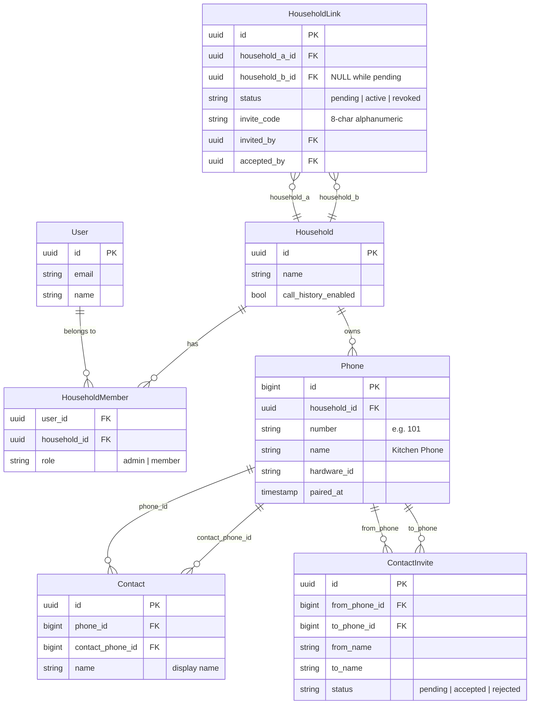
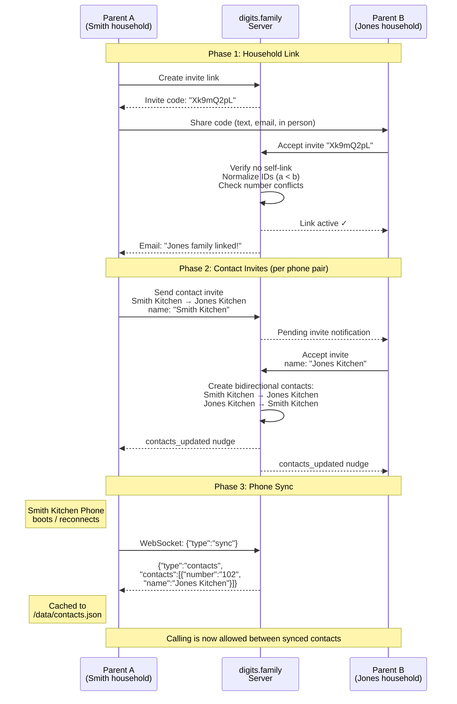
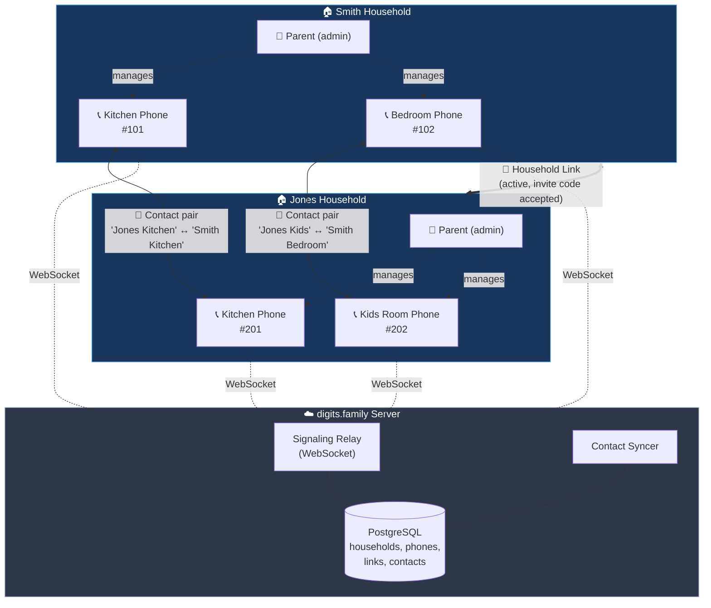
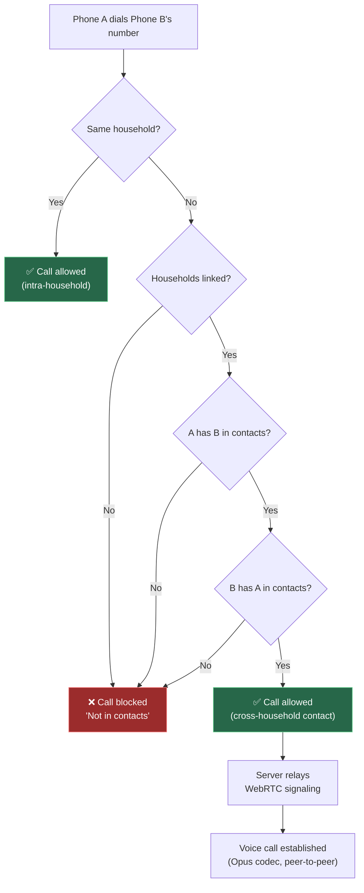
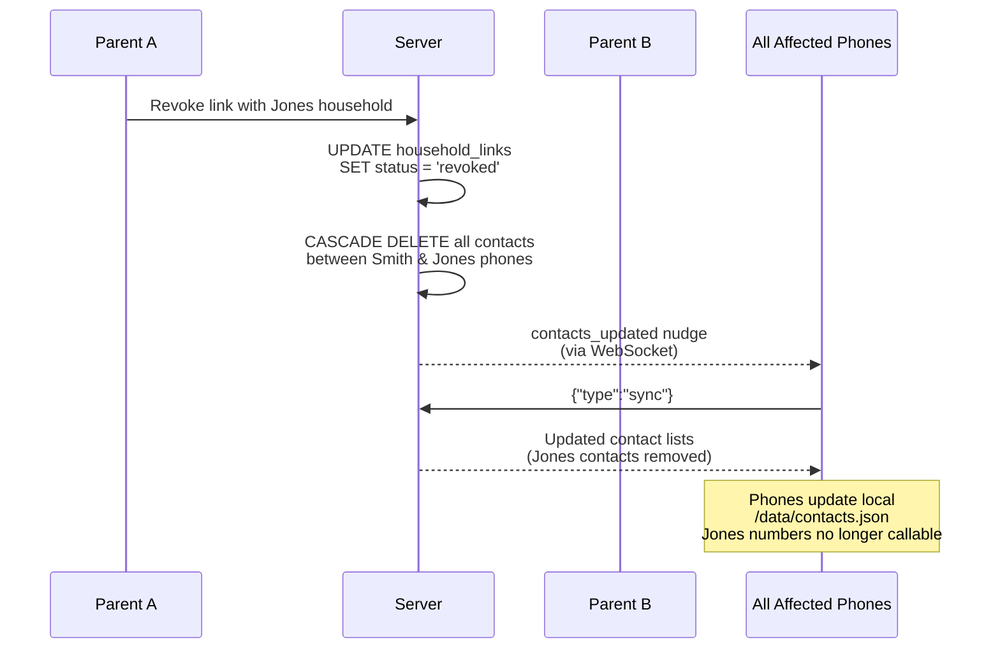

# Digits Cross-Household Phone Linking

## 1. Data Model

How households, phones, links, and contacts relate to each other.

## 2. Household Linking Flow

The step-by-step process of connecting two households.

## 3. System Overview

High-level view of two linked households with phones and contacts.

## 4. Call Permission Flow

How the system decides whether two phones can call each other.

## 5. Revocation Flow

What happens when a household link is revoked.

